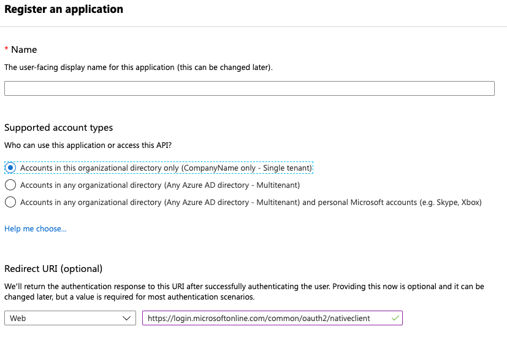
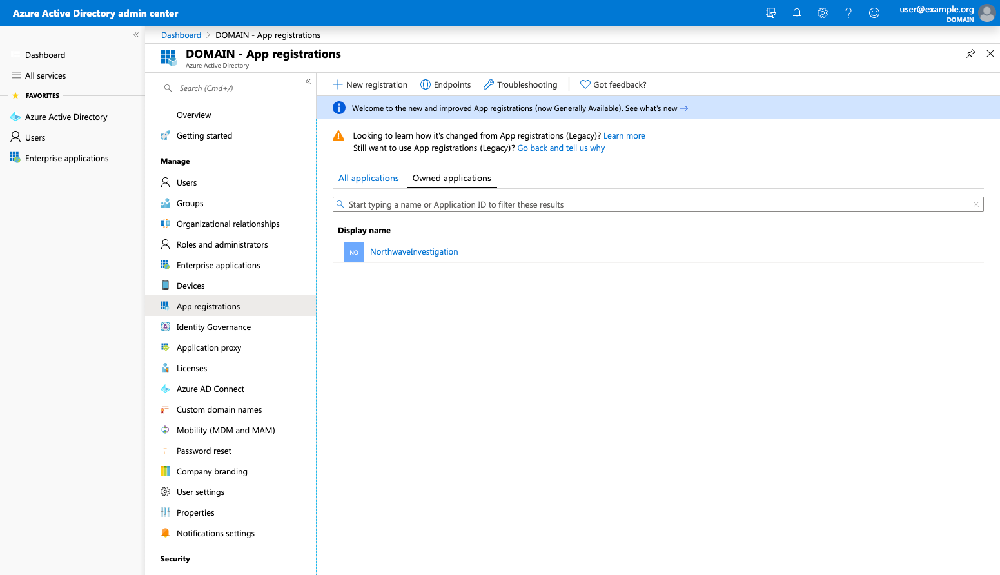
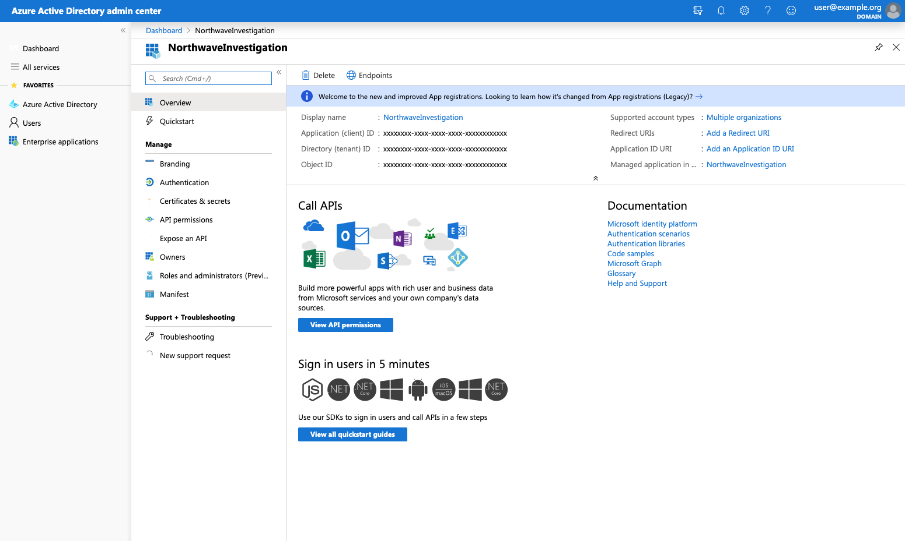
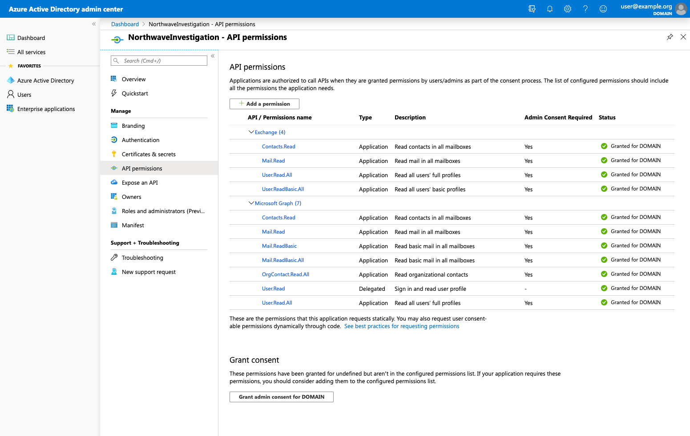
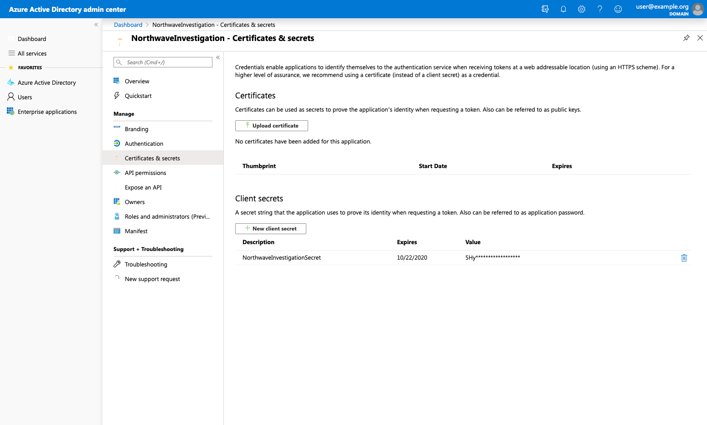

# O365 App Registration

In order to acquire contents from Office 365 environments, an App Registration must be created within the Office 365 tenant. This must be setup within the [Azure Active Directory portal](https://portal.azure.com/#blade/Microsoft_AAD_IAM/ActiveDirectoryMenuBlade/Overview). In order to assign the right privileges to the App Registration, an admin account is required.

## 1. Make new registration

After having logged in, go to `App registrations` and create a new registration using an arbitrary name.

When delegated permissions are needed, fill in `https://login.microsoftonline.com/common/oauth2/nativeclient` at Redirect URI (see below).

---

After clicking `Register`, the App registration has finished and listed.

## 2. Copy Tenant ID and Client ID

When clicking on the newly generated App Registration, make a note of the Application (client) ID and the Directory (tenant) ID.

## 3. Set API Permissions

In the menu, select `API Permissions` and make sure you add all of the below permissions (found in Microsoft Graph and Exchange categories). When adding permissions, you can select 'Delegated' or 'Application' as type. Delegated means that a user needs to give consent when data is acquired from his account. Application means that no user consent is required, but this ofcourse requires good alignment with the customer regarding user privacy and investigation scope.

## 3. Create and copy Client Secret

After having set the right permissions, select `Certificates & secrets` in the App Registration menu and create a new client secret. This client secret will be needed by the O365 acquisition script to authorize to the O365 API. Make sure you directly make note of the newly generated client secret as it will only be shown once.

